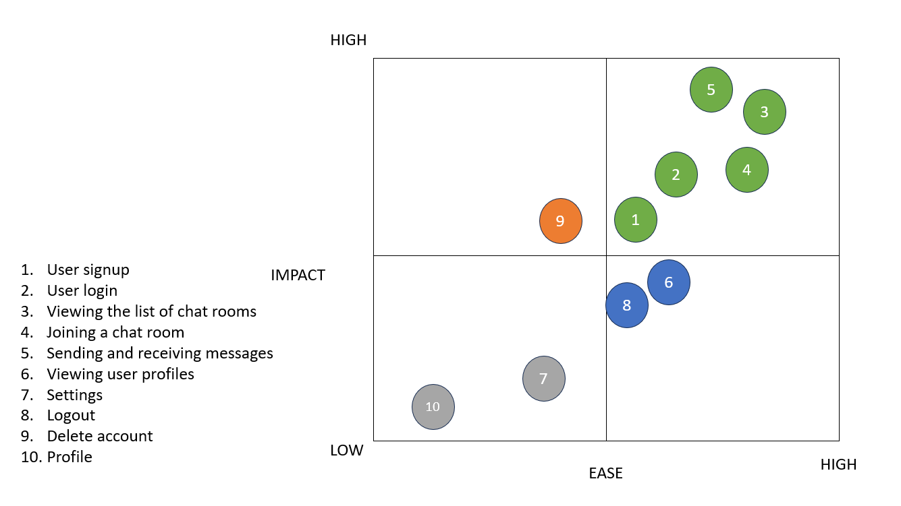
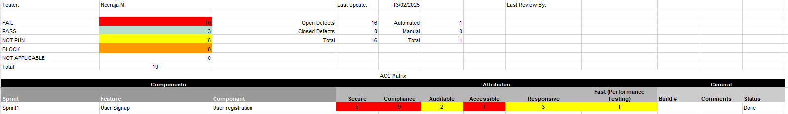

# Datacom Bug Form - User Registration Testing

## Introduction 
Bug Form is a testing form that allows user to register. 

## Challenge (Tasks)

- Task 1: Functional Testing (Done)
- Task 2: Automation (Done)

## Prerequesites 

- Download & Install Node JS

## Environment setup
1. Git Clone this repository
2. npm install
3. npm test

## Scope
Develop detailed test cases for the following functionalities:
- User Registration

> Note: Ensure the test cases cover both positive and negative scenarios.
> This is not part of the test but this is to demostrate how i scope and prioritise test scenarios

## Prioritise Components (features) 

**For this step i would use an AISE Matrix, to identify the following combination:**

high impact high ease (P1 - High Impact customer's features and High ease Testing effort)

high impact low ease (P2 - High Impact customer's features and Low Testing effort)

Low impact high ease (P3 - Low customer impact features and High ease Testing effort)

Low impact low ease (P4 - Low customer impact features and Low Testing effort)

**The output of this step is a prioritised matrix as an example of my previous project**:

## Testing Approach  

In order to test the Bug Form,  I would follow the ACC (Attribute, component, capability) testing approach, this approach was design by google and its primary objective is to test capabilities over features, I personally find this approach very useful since it helps the team to have common understanding about the product or component

> Note: 
A capability is the intersection between an attribute and a component, for example we can be testing the Secure attribute of the login component, we can then say the 'Login component is Secure When un-authorized user Do NOT have access to Bug Form' 

**For the testing of Bug Form I would used the following attributes:**

**Secure**: Focus in finding any type of vulnerability in the application

**Compliance(Functional Testing)**: Focus in testing any expected results or acceptance criteria

**Auditable**: Focus in testing any transaction traceability

**Accessible**: Focus in testing the application from the perspective of a person with different abilities

**Responsive**: Evaluating the user experience of the application on different screen sizes

**Fast (Performance Testing)**: Evaluating the performance aspect of the application and its response time

> Criteria:  
> - Conduct basic performance testing to measure the app’s responsiveness and load times.
> - Test the app’s performance under different network conditions (e.g., 3G, 4G, Wi-Fi).
> - Measure the time taken for messages to be sent and received.
> - Document the performance metrics and any observed issues. 

## Test Report

### [Download Report Here...](Matrix_Reactapp.xlsx "download")

## Automation setup

### Process 

1. Git Clone this repository
2. npm install
3. npm test

### Test covered 

- Signup --> (test_01)
- Validating user entry such as first name, last name... etc 
